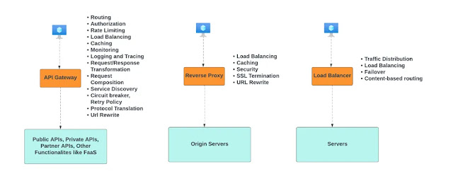

# Selamün Aleyküm Arkadaşlar,

Bu seride toplamda 16 yazı bulunmaktadır (giriş yazısı hariç). Yazılarda eksik fazla olduğunu düşündüğünüz noktalar için geri dönüşleriniz ve PR'larınızı bekliyoruz!

**Giriş: Index[0]**

Çok uzun süredir notlarımda olan ve hep yazmak istediğim bir seriye Allah’ın izniyle başlıyorum. Yıllar önce izlemiş olduğum [bu videoda](https://www.youtube.com/watch?v=a3ehu_Yv96U&t=2671s&ab_channel=MustafaVarank) not aldığım 16 başlığı 16 ayrı yazı olarak ele alıyorum. Sadece başlıkları buradan almış olup içeriği özgün olarak oluşturmaya gayret ettim. Böyle düşününce gerçekten zor bir hedef gibi görünüyor, ancak birincisine niyet edip başlarsak inşaAllah gerisi de gelir diye düşünüyorum..

Bu yazı girizgah yazısı olacak. Hangi konuları ele alacağımızı belirtip özet mahiyetinde birkaç cümle ile kısa kısa açıklamalar yapacağız. Daha sonra yeni yazıları yazdıkça buradaki linkleri de güncelliyor oluruz inşaAllah. Bazı konular hakkında daha çok bilgi sahibiyken bazı konularda benim de daha fazla okumalar yapmam lazım. Bu yolculuğa bir "assignment" [projesi](https://github.com/malikmasis/TelephoneDirectory) ile başlayıp onu belirli aralıklarla geliştirmeye devam ettim. Bunu daha önce bu [yazımda](https://medium.com/software-development-turkey/mikroservis-maceram-1e070463d0ea) dile getirmiştim. Devam eden süreçte de ayrıca bir yazı yazmadım. Hep bu yazıyı güncelleyerek veya Github projesini geliştirerek devam ettim, ancak bu sefer önüme zorlu da olsa bir hedef koymak istedim. Rabbim utandırmasın.

Mikroservis nedir, ne değildir gibi sorulara girmeyi pek düşünmüyorum açıkçası. Bu yazı serisi biraz daha bu işi bilen ya da en azından merak eden kesime yönelik olacak. Her ne kadar son projemde çok etkin bir şekilde bu yapıları kullansam da konuların derli toplu olması açısından veya projeye dalıp kaçırdığımız noktalar var ise öncelikle kendimi de geliştirmek açısından ele alıyorum. Hata, eksik veya fazla olduğunu düşündüğünüz yerler olursa elbette desteklerinize açık olduğumu da belirtmeden geçemeyeceğim.

Mikroservis konusu ile ilgili kendi adıma diyebileceğim en net şey, gerçekten ihtiyaç olduğuna ikna iseniz ve buna da uygun takım ya da takımlarınız var ise bu işe girmenizi naçizane öneriririm. Aksi halde siz ve ekibiniz için çok zorlu bir dönem başlayabilir. Nedenlerini önümüzdeki yazılarda zaman zaman değiniyor oluruz. Ufaktan başlayalım.

---

1. **[Bounded Context](#1-bounded-context)**: Domain Driven Design ile bağlamı net bir şekilde ortaya koymak gerekir. Bağlam düzgün kurgulandığında birçok şey daha kolay oluyor. Fazla veya eksik olduğunda ise buradaki hatalarınızı gidermek için fazlaca yıpranabilirsiniz. Şahsi fikrim burası işin kalbi...

2. **[Async Messaging](#2-async-messaging)**: Asenkron iletişim mikroservis sisteminin olmazsa olmazıdır. Hem servisler arası iletişimde hem de uzun süren işlemlerde ilaç gibi gelir.

3. **[Composing Microservice](#3-composing-microservice)**: Gelen isteğin cevabını birçok servisten toplayarak farklı kanallar üzerinden toplayarak bunu cevap olarak döner. Bu konunun hızlıca anti-pattern'a dönme ihtimali var. Bunun için de bazı çözümler öneriliyor.

4. **[Achieving Data Consistency](#4-achieving-data-consistency)**: Mikroservis konusunun şahsımca en zor konusu bu olabilir. Veri tutarlığını sağlamak için bir sürü pattern olsa da bunu tam anlamıyla mükemmel uygulamak gerçekten kolay bir şey değil. Burası ne kadar sorunlu olursa o derece operasyon maliyeti artıyor.

5. **[Centralizing Access](#5-centralizing-access)**: Dışarıdan gelen tüm isteklerin nerelere nasıl yönlendirileceğini ele alır. Birbirine benzeyen ve çok karıştırılan 3 yapıya da değineceğiz. Özetle kalenin giriş kapıları olarak düşünebiliriz.

6. **[Separated Databases](#6-separated-databases)**: En sık düşülen hatalardan veya monolit yapılardaki geçişlerde en zorlanılan konulardan biridir. Her bir servisin ayrı bir veritabanı olmalıdır. Aksi halde veri tabanındaki herhangi bir hatada bütün sistem de çökmüş olacaktır.

7. **Arch Api-based**: Api tabanlı iletişimi ele alır. Bunu sağlamanın birden çok yolu var. Her birinin de kendine göre avantaj ve dezavantajları var.

8. **Resiliency**: Bir servise yapılan çağrıların belirli bir sebepten dolayı cevap vermemesi sonucu orada bağlantıyı keserek bütün sisteme yük binmesine engel olur. Belirli dönemlerde buradaki problem düzelip düzelmediğini kontrol eder, düzelmiş ise tekrar bağlantıya izin verir.

9. **Backward Compatibility**: Eskiye yönelik servislerin çalışırlığını ele alır. Bunun için versiyonlama kullanılan genel çözümlerden biridir. Aksi halde yaptığınız radikal bir değişiklik (breaking change) burayı kullanan eski istemcileri olumsuz etkileyecektir.

10. **Documenting Contracts**: İstemci ve sunucu arasında bir protokol, anlaşma diyebiliriz. Interface'ler ile yazılımda nasıl bazı konular için el sıkışıyorsak bunu da öyle anlayabiliriz desek yanlış ifade etmiş olmayız herhalde. Open Api gibi standartlarla bunları ele alabiliriz.

11. **Centralized Logging**: İlk başta çok önemsenmese de servisler arttıkça hatalar oldukça loglamanın önemini çok daha iyi anlıyorsunuz. Özellikle debug yapmanın zor olduğu böyle bir ortamda bu çok daha kıymetli olmaktadır.

12. **Cloud Based Infrastructure**: Bu başlık itibariyle biraz daha devops tarafına girişmeye başlıyoruz. Fiziksel sunucular yerine buluttaki hizmetleri ele almayı önerir. Birçok güzelliği olsa da elinizi verdiğinizde kolunuzu kaptırma ihtimaliniz de var :)

13. **Deployment Automation**: Bu işe girişmeyi düşünüyorsanız manuel deployment'i hayatınızdan çıkarmış olmanız gerekiyor. Servisleriniz her birinin otomatik olarak sunuculara gitmesi gerekmektedir. Hatta gün içinde istediğiniz anda bu işi de yapabiliyor olmalısınız.

14. **Configuration Management**: Dev test prod gibi farklı ortamlarınızın olması gerekir. Bu aslında monolit yapılarda da olan bir konu ancak bazen gün içinde birden fazla deployment hedeflenen sistemlerde olmazsa olmaz durumuna dönüşüyor.

15. **Service Registry & Discovery**: Servislerin birbiriyle iletişim kurduğu durumları ele alır. Özellikle dinamik olarak ölçeklenme, dağıtılma gibi konularda daha da önemi artmaktadır. Yine birçok konudaki gibi bunu da yapan bazı araçlar mevcut.

16. **Monitoring**: Birden fazla servisiniz varsa bunları yönetmek de doğal olarak zorlaşabiliyor. Bunlardan herhangi birinde bir problem olduğunda kullanıcıdan önce sizin haberiniz olmalı. Hem durumları takip edebileceğimiz hem de bize alarm durumlarını önceden haber etmeye olanak sağlar.

---

**Sonuç:**

Yukarıdaki 16 konuya ufak ufak bazı notlar yazmaya çalıştık. Yazının devamında her bir konuyu ayrı ayrı olarak ele almayı düşünüyoruz. Niyet bizden, takdir ve başarı Allah'tandır.

Ben bu yazıyı taslak olarak yazarken şu an hala Gazze'deki insanlar açlıktan ölüyor. Rabbim buradaki kardeşlerimize de büyük bir zafer ihsan eylesin. Dualarımı ve bu yazı serisini, niyetleri Allah'ın rızasını kazanmak olan bu koca yürekli insanlara ithaf ediyorum.

**“Ve de ki: ‘Bütün başarı ve zafer, sadece Allah’tandır.’” (Al-i İmran, 3:126)**

### 1. Bounded Context

&nbsp;&nbsp;&nbsp;&nbsp;&nbsp;&nbsp;Özette de belirttiğimiz gibi bu işin kalbi bana göre sınırları doğru çizebilmek. Sınırları doğru ve net belirlediğimizde geriye kalan işler kolaylaşacaktır. Monolit yapılarda veritabanı tasarımının projedeki en önemli kısım olduğunu düşündüm hep. İyi bir veri tabanı iyi bir backend yazılımına, o da iyi bir arayüze ve günün sonunda iyi bir uygulama vesile olur. Mikroservis mimarisinde ise aynı şeyi "bounded context" için düşünüyorum. Hazırsak başlayalım.

&nbsp;&nbsp;&nbsp;&nbsp;&nbsp;&nbsp;Konuya bir anı ve ardından gelen bir soru ile girmekte fayda olabilir. Girdiğim bir mülakatta konu DDD'ye gelmişti. Ben de projemi bu yaklaşıma uygun geliştirdiğimi söylemiştim. Buna karşılık mülakatı yapan kişi bana peki DDD sadece yazılımcı için olan bir konu mu demişti?

&nbsp;&nbsp;&nbsp;&nbsp;&nbsp;&nbsp;Dürüst olmak gerekirse öyle bir soruyu hiç beklemiyordum. Daha önce de yaptığım bazı okumalarla birlikte yazılımcı bunun önemli bir parçası ama her şeyi değil demiştim. Gerçekten de bu ekipçe aynı dili, terminolojiyi kullanmaktan geçer. Ekip dediğim sadece yazılımcılardan bahsetmiyorum. Bunlarla birlikte ürüncü, testçi, analist ve artık daha kimler varsa. Özetle bu işin altına elini sokmuş tüm arkadaşlar diyebiliriz.

&nbsp;&nbsp;&nbsp;&nbsp;&nbsp;&nbsp;Genel manada her bir bağlam (bounded context) bir mikroservisi teslim eder, edebilir. Muhtemelen çokça karşılaşmışsınızdır. Order, Payment, Product gibi servis isimleri geçer. Mikroservis teknolojisinin öncülüğünü bizim ülkede e-ticaret siteleri yaptığı için (ya da onlar daha önce çıkardığı için de olabilir) genelde örnekler de hep buradan geliyor. Farklı domainlerde çalışıyorsanız oturup biraz daha düşünmeniz veya kendi yoğurt yiyişinize göre sistemi tasarlamanız gerekebilir.

&nbsp;&nbsp;&nbsp;&nbsp;&nbsp;&nbsp;Şu an ben mobilite sektöründe çalışıyorum. Bu yüzden bizim kapsamlar baya farklı. Bağlamları belirlerken Rental (kiralama süreci), Vehicle (araç ve iot), Branch (bölge yönetimi) diye bizim birbirinin içine giren ama aslında farklı olabilecek 3 domainimiz vardı (diğerlerini net bir şekilde belirledik). Bunları ayrı birer bağlam mı yoksa hepsini tek bağlam altında toplama konusunda kararsızlık yaşadık. Benim şahsi fikrim bunları ayırmanın daha doğru olacağı yönündeydi, ancak bunları birlikte ele alarak devam ettik.

&nbsp;&nbsp;&nbsp;&nbsp;&nbsp;&nbsp;Geliştirmeler tüm hızla devam ediyor. 10 kişilik yazılım ekibi aynı projede geliştirmelerini sürdüyor (aslında 3 takım, her takımın, ayrıca yazılımcı olmayan üyeleri de var tabii ki). Zamanla kapsamlar birbirine yaklaştıkça toplantılar yaparak problemleri gidererek yolumuza hızlı bir şekilde devam ettik. Kapsamları birleştirmeye ilk başta çok sıcak bakmasam da zamanla tabii ki sıkıntılar çıksa da bunun çok daha iyi olduğunu anladım. En azından bizim için iyi olduğunu anladım.

&nbsp;&nbsp;&nbsp;&nbsp;&nbsp;&nbsp;Ayağı yere daha iyi basan veya daha oturmuş ekiplerle, daha uzun vadeli bir geliştirme yapılıyor olsa belki hala bu bağlamları ayrı ayrı ele almak iyi olacaktı. Ancak alınan kararlar göre değişkenlik gösterebiliyor. Teknik olarak doğrusu yanlışından ziyade bu işin size neler getirip sizden neler götüreceğini iyi tespit etmek lazım. Yoksa öteki türlü her çözüm her yere uygulanabilir olsaydı bu sektör belki de buralara gelmeyecekti...

&nbsp;&nbsp;&nbsp;&nbsp;&nbsp;&nbsp;Başka bir projede de yaşadığım başka bir tecrübeden bahsetmek istiyorum. Bu işe sonradan dahil olduğum için, yapılan işi ve hangi sıkıntılarla karşılaştığımızdan bahsedeceğim. Yaklaşık 13-15 mikroservisli bir var ve bazıları mikroservis değil [nanoservis](https://nanoservices.io/docs/docs/concepts/nanoservice/) seviyesine gelmiş. Tablolar birbiriyle direkt ilişkili. A servisinden veriyi B servisine senkron olarak çekip oradan gelen veriye göre iş yapılıyor. Bu 1-2 defa yapılan bir iş değil bütün kurgu maalesef bu şekilde. Yani her ayrı olan kavramı ayrı birer mikroservis olarak ele almışlar, ancak orada "over engineering" oluşmuş ve günün sonunda ekipçe oturup bu servislerin bazılarını birleştirelim diye karar aldık.

&nbsp;&nbsp;&nbsp;&nbsp;&nbsp;&nbsp;2 ayrı örnekte de belirttiğim gibi, bu işin doğrusu yanlışından ziyade uygulanabilirliği önemli diye düşünüyorum. Her şeyi servislere bölmek de yanlış bir seçim, bütün her şeyi de tek bir servis altında toplamak zaten ayrı bir yanlış seçim olabilir. Bu işin dengesini ve kararını iyi verebilmek lazım. Orada düşünüp vereceğimiz bir karar inanın bütün projenin geliştirme sürecini çok derinden etkileyecektir. O yüzden kervan yolda düzülür gibi kararlardan naçizane sıyrılmanızı tavsiye ederim. Projeyi canlıya bile almadan her yeri yamalanmış bir proje ile karşı karşıya kalabilirsiniz veya daha kötü canlıya bile çıkmadan yolun sonuna gelmiş olabilirsiniz...

&nbsp;&nbsp;&nbsp;&nbsp;&nbsp;&nbsp;Özetle, projenin isterlerini ve gereksinimlerini iyi analiz ederek kapsamları doğru bir şekilde ortaya koymak projenin en kritik noktası olabilir. Bu yüzden başlangıç noktasında çok acele etmeden çok da "over engineering" yapmadan size uyacak en doğru kararı vermeniz duasıyla.

&nbsp;&nbsp;&nbsp;&nbsp;&nbsp;&nbsp;Bu bölümü birer ayet-i kerim ve hadis-i şerif ile bitirelim.

> "Biz her şeyi bir ölçüye göre yarattık." (Kamer, 54/49)

> "Muhakkak ki Allah, her işte ihsanı (en iyi şekilde yapmayı) emretmiştir." (Müslim, Sayd, 57; Ebû Davud, Edahi, 11)

 ### 2. Async Messaging
 
&nbsp;&nbsp;&nbsp;&nbsp;&nbsp;&nbsp;Serinin ikinci bölümünde asenkron iletişimi ele alacağız. Servisler arası iletişimde temelde iki yöntem var. Bu yöntemlerden biri senkron (rest api, grpc) ve diğeri asenkron olarak ele alabiliriz. Birbirilerine göre avantaj ve dezavantajları olsa da servislerin birbirine olan bağımlılıkları en aza indirgemek için asenkron iletişim bu işin temel parçalarından biri haline geliyor. Hazırsak başlayalım.

&nbsp;&nbsp;&nbsp;&nbsp;&nbsp;&nbsp;Bir mikroservis sistemi tasarımında mümkün mertebe servisleri birbirinden izole olmasını isteriz. Bunun sebeplerinden bir tanesi o servisle ilgili herhangi bir olumsuzlukta sistemin ayakta kalmaya devam etmesidir. Örneğin, kampanyalar servisiniz düştü ancak kullanıcı hala alış-verişini yapmaya devam edebilmeli. Kampanya servisi düştüğü için bütün sistemin çalışılmaz hale gelmesine gerek yoktur.

&nbsp;&nbsp;&nbsp;&nbsp;&nbsp;&nbsp;Servislerin birbirine gevşek bağımlı hale gelmesini peki nasıl sağlarız? Bunun çözümlerinden biri, iletişimin asenkron olmasıdır. Senkron olan iletişimde servislerinden biri çöktüğünde diğer servis oradan gelecek cevabı bekleyecektir ve bu da sistemde bir gecikmeye sebep olacaktır (tabii ki bunun da çözümleri mevcut. Circuit breaker, timeout, fallback vb), ancak iletişim asenkron olduğunda bu problemler oldukça azalır (tabii ki farklı problem çıkabilir :) ).

&nbsp;&nbsp;&nbsp;&nbsp;&nbsp;&nbsp;Peki her servis çağrısında asenkron iletişim mi kullanmalıyız? Bunun için mümkün olduğunca sistemi esnek tutabilmek açısından evet ama bazen diğer servislerden gelen cevabı beklememiz gerekiyorsa o zaman senkron iletişim kaçınılmaz hale geliyor. Ancak bazen de verilerin her iki servisin veri tabanında da tutulması konusu gündeme gelebilir. CDC (Change Data Capture) konusuna önümüzdeki yazılarda değiniyor olacağız.

&nbsp;&nbsp;&nbsp;&nbsp;&nbsp;&nbsp;Asenkron mesajlaşmanın daha da önemli hale geldiği konulardan bazıları; uzayan veya hemen işlenmesi çok kritik olmayan konular. Eposta, sms veya bildirim atmak, log işlemleri bunlara örnek olarak gösterilebilir. Bu tarz işlemler için bu konu daha da önemli hale gelebilir.

&nbsp;&nbsp;&nbsp;&nbsp;&nbsp;&nbsp;Asenkron mesajlaşmada kullanılan birçok araç var. Bu araçlardan en göze çarpanları rabbitmq, kafka veya bulut çözümlerin kendi ürünleri de mevcut (amazon sqs, azure service bus). Bu araçların birbirlerine göre fiyat, performans gibi birçok artı ve eksi yönleri var. Dotnet dünyasında özellikle Rabbitmq'nin çok kullanıldığına şahit oluyorum ve onu implemente eden açık kaynaklı proje olan MassTransit ile birlikte kullanımı daha da kolay hale gelebiliyor.

&nbsp;&nbsp;&nbsp;&nbsp;&nbsp;&nbsp;Asenkron mesajlaşmayı çok övdük de hiç mi eksik yanı yok derseniz, tabii ki her hastalığa aynı ilacı vermek söz konusu olamaz. Yukarıda da bahsettiğimiz gibi cevap bekleyen durumlarda veya basit sistem tasarımlarında bunu kullanmak sistemi daha karmaşık hale getirecektir. Öğrenmesi, yönetmesi ve takip etmesi gibi bazı zorlukları getirir. Verilerin doğru bir şekilde işlenmesi, iletilmesi, bazı durumlarda çoklanması gibi farklı zorluklar ortaya çıkmaktadır (veri tutarlığı konusuna ileride değiniyor olacağız). İlk başlarda bu zorlukları aşmak da çok kolay olmuyor.

&nbsp;&nbsp;&nbsp;&nbsp;&nbsp;&nbsp;Özetle, asenkron mesajlaşma mikroservis mimarisinde bir zorunluk olmasa da önemli yapı taşlarından biridir. Genel sistem içerisinde tabii ki senkron ve asenkron iletişimin birlikte kurgulanabilir, hatta kurgulanmalı. Nereden hangisini kullanılacağını tespit edip ona göre işlemleri devam ettirmek en doğrusu olacaktır.

&nbsp;&nbsp;&nbsp;&nbsp;&nbsp;&nbsp;Bölümü birer ayet-i kerim ve hadis-i şerif ile bitirelim.

> "Ve yardım edin birbirinize takvada ve takvaya davette, günah ve düşmanlıkta ise yardım etmeyin." (Mâide, 5:2)

> "Dil bir kılıç gibidir, onunla ya kurtulursun ya da helak olursun." (İbn Mâce, Zühd, 19)

 ### 3. Composing Microservice

&nbsp;&nbsp;&nbsp;&nbsp;&nbsp;&nbsp;Serinin üçüncü bölümünde "composing microservice" konusunu ele alacağız. Birden çok servisten gelen cevapları toplayarak yanıt olarak istemciye (client) geri döner. Mikroservisin bağımsızlık ilkesine ters olsa da iş modelinin isterlerine göre kaçınılmaz olabiliyor. Bu durum, genel tasarıma zarar verebileceğinden burayı tasarlamak ilerideki birbirine bağımlı servislerin oluşmasına engel olmak açısından çok önemlidir. Hazırsak detaylarına inelim.

&nbsp;&nbsp;&nbsp;&nbsp;&nbsp;&nbsp;Genel itibariyle çok fazla servisimiz olduğunu varsayalım. Her birinin yaptığı işler belli, ancak gerçek hayattaki isterler tahmin edebileceğiniz üzere çok karmaşıklaşabiliyor. Bazen birden çok servisten bilgiyi toplayarak bir yanıt dönmemiz gerekiyor. Böyle durumlarda başvuracağımız yöntemlerden biri de bu servislerden gelen cevapları alarak toplu bir yanıt dönmek olacaktır. Bunun bazı yöntemleri var:

&nbsp;&nbsp;&nbsp;&nbsp;&nbsp;&nbsp;Api üzerinden bu verileri toplayarak gerekli cevaplar dönebiliriz, bununla birlikte Orchestration dediğimiz merkezi bir yapı ile bunu yapabiliriz. Servisleri sırasıyla çağırıp cevapları birleştirerek iletir. Choreography denilen diğer bir yapı ise merkezi bir yapı olmadan servislerin kendi arasında haberleşerek bu işi yapmasıdır. Servis sayısı veya karmaşıklık az ise bu yöntem daha uygun olabilir.

&nbsp;&nbsp;&nbsp;&nbsp;&nbsp;&nbsp;Bu yöntemlerin hepsi genel itibariyle aynı probleme çözüm araralar ama beraberinde de bazı zorluk ve sıkıntılara sebebiyet verebilirler. Veri tutarsızlığı (sonraki konumuz), performans problemleri, hataların yönetimi gibi zorlukları da beraberinde getirir. Bunlara önlem olarak tabii ki çözümler üretmek mümkün. Ancak bu problemlere bulaşmadan bu işleri çözebilir miyiz sorusu da insanın aklına gelmiyor değil.

&nbsp;&nbsp;&nbsp;&nbsp;&nbsp;&nbsp;Bunlara alternatif bazı yöntemler elbette var ancak her birinin de kendisiyle birlikte getirdiği zorluklar oluyor. CQRS, GraphQL, veri çoklama(duplicate) ve bağlamların doğru bir şekilde tasarlanması örnek verilebilir. Dediğimiz gibi her birinin de beraberinde getirdiği zorluklar olsa da burada problemi doğru tespit edip bizlere hangi çözümün daha uygun olduğunu ortaya koymak işin teknik zorluğu diye düşünüyorum.

&nbsp;&nbsp;&nbsp;&nbsp;&nbsp;&nbsp;Bu arada bu çözümlerin birini kullandık diye diğerlerinden vazgeçmek zorundayız anlamına gelmez. Bunların birlikte kullanılması da mümkün. Örneğin bir servisten diğerine çağrıda bulunuyorsunuz ve sadece bir veriyi almanız gerekir, böyle bir durumda veri çoklama (Data Repliction) çözüm olabilir, ancak gittiğiniz servisten birçok önemli veriyi almanız gerekiyordur ve bütün bu verileri kendi tarafınıza taşımak doğru değil ise o zaman da isteği yapıp gelen veri kullanabilirsiniz. Bazen de  birçok servisten cevap almanız gerekiyordur o zaman da bunu gateway seviyesinde yapabilirsiniz. Dediğimiz gibi her birinin artı ve eksi yönleri olsa da bunun doğru veya yanlış bir cevabından ziyade size uygun olan cevabı önemli olur.

&nbsp;&nbsp;&nbsp;&nbsp;&nbsp;&nbsp;Özetle iş ihtiyaçlarına göre bazı konularda farklı çözümler bulmamız gerekebilir. Çözümleri uygularken artı ve eksilerini iyi düşünüp kendi yapımıza uyarlarken, bunların eksi olan yöntemlerini nasıl sıfıra indirgeyebiliriz diye düşünüp o çözümleri de uygulamak genel manada güzel olur diye düşünüyorum.

&nbsp;&nbsp;&nbsp;&nbsp;&nbsp;&nbsp;Yazıyı bir ayet-i kerime ve her probleme ayrı bir çözüm sunan Peygamber Efendimiz(s.a.v.) ile ilgili olan bir hadis yorumu ile bitirmek istiyorum.

> "Rabbinin yoluna hikmetle ve güzel öğütle çağır ve onlarla en güzel şekilde mücadele et. Şüphesiz ki Rabbin, yolundan sapanları da en iyi bilendir; hidayete erenleri de en iyi bilendir." (Nahl, 16/125)

> “Ey Allah’ın Resûlü! Hangi amel daha faziletlidir?” diye sorduğunda, farklı sahabilere farklı cevaplar verdiği görülür. 
- Örneğin: Biri için “Namazı vaktinde kılmak” 
- Bir başkası için “Ana babaya iyilik etmek” 
- Bir diğeri için ise “Allah yolunda cihad etmek” cevabını vermiştir. 
> Bu hadis, insanların durumlarına, ihtiyaçlarına ve önceliklerine göre çözüm sunmanın İslam’da önemli bir ilke olduğunu gösterir. (Buhârî, Edeb 1; Müslim, İman 137)

### 4. Achieving Data Consistency

&nbsp;&nbsp;&nbsp;&nbsp;&nbsp;&nbsp;Serinin dördüncü bölümünde, dananın kuyruğunun koptuğu bir konuyu ele alacağız: Veri tutarlığı. Önce bu konu neden önemli, sağlanmadığında ne gibi problemler yaşanabilir, ardından monolit yapılarda bunu nasıl sağlıyoruz ve son olarak da mikroservislerde ne gibi zorluklar yaşanıyor ve buna sunulan çözümler nelerdir gibi konulara değinmeye çalışacağız. Hazırsak başlayalım.

&nbsp;&nbsp;&nbsp;&nbsp;&nbsp;&nbsp;Veri tutarlığı konusu gerçekten çok geniş, bu konuyu iyi anlayabilmek için öncelikle ACID ve CAP konularını iyi anlamak gerekiyor. Buralardaki başlıklar nelerden bahsediyor veya herhangi bir veri tabanını tercih ettiğimizde nereden feragat ettiğimizi doğru anlamamız gerekiyor. Bu hem monolith yapılar için hem de mikroservis yapılar için geçerlidir. Temel mantık oturduktan sonra geriye kalan işler yöntem ve prensiplerdir.

&nbsp;&nbsp;&nbsp;&nbsp;&nbsp;&nbsp;Monolit yapılarda veri tutarlığını sağlamak mikroservis yapılara göre daha kolay. Bunun en önemli sebebi tek bir veri tabanının kullanılmasıdır. Böyle olunca tek transaction üzerinden tüm işleri bekletip tüm işlemler başarılı olduğunda bunu onaylıyoruz. Kullandığımız ORM araçları bunlara varsayılan ayarlarla bir yere kadar çözümler üretiyor. Sizin özel kullanımlarınıza göre bunlar tabii ki ayarlanabilir. Şuraya güzel bir yazı bırakayım. Bizler yolculuğumuza devam edelim.

&nbsp;&nbsp;&nbsp;&nbsp;&nbsp;&nbsp;Monolit yapılardaki en kolay konu bile mikroservislerde karmaşıklaşabiliyor. Bunun sebebi birçok servis, veritabanı, farklı yapılar… Özetle büyük sistemlerde dolaşmak doğal olarak daha zor oluyor, ancak veri tutarlığı gibi bir yapı biraz daha zor olabiliyor. Özellikle birbiriyle haberleşen servisler arttıkça bunu yönetmek zorlaşıyor. Çünkü herhangi bir adımda meydana gelen hataya göre bir önlem almak lazım ve bu işleri geri almak gerekir. Bu yapılan geri almaların başarılı olacağını bir yere kadar garanti edebiliyoruz. Bunu sağlayan çözümlerimiz bulunmaktadır.

&nbsp;&nbsp;&nbsp;&nbsp;&nbsp;&nbsp;Mikroservislerde veri tutarlığı dediğimizde aklımıza ilk gelen şey, mülakatların gözbebeği, SAGA pattern olsa gerek. Saga denilince temelde iki şey karşımıza çıkar. İlki merkezi bir yapı kurgulayan Orchestration ve diğeri servislerin birbiriyle haberleştiği Choreography. Her iki yöntemin de kullanılacağı durumlar var. Orchestration 3–4 servis sonrası kullanımda tavsiye edilirken Choreography daha az servisin birbiriyle haberleşmede kullanılması tavsiye ediliyor. Çünkü Choreography'de tüm servisler birbirlerine gelerek bu işlemleri yönettiği için daha zor yönetebiliyor. Daha az servis kullanımında ise karmaşık yapıya girmeden kendi aralarında bunu çözebiliyorlar. Birçok yerde dediğimiz gibi probleme göre çözüm burada da var.

&nbsp;&nbsp;&nbsp;&nbsp;&nbsp;&nbsp;İkinci bir yöntem ise 2PC (Two Phase Commit) tasarım şablonudur. Ya hep ya hiç kuralını işletir. Veri tutarlığı garantisi verir, ancak bütün işlemleri beklettiği için performans ile ilgili problemlere sebebiyet verebilir ya da her durum için uygun olmayabilir diyelim. Burada ödeme ile alakalı çok kritik bir işlem yapıyorsanız sizin için uygun olurken, daha toleranslı olabilecek işlemler için tercih etmeyebilirsiniz. Hem cam kenarı hem koridor olsun diyemiyoruz. Bir şeyi seçerken başka bir şeyden feragat ettiğimizi unutmayalım. Özetle bu yapı mikroservislerde çok fazla tercih edilmez bunun yerine eventual consistency (nihai tutarlılık) tercih edilir.

&nbsp;&nbsp;&nbsp;&nbsp;&nbsp;&nbsp;Yardımcı çözümlerden biri olan Inbox/Outbox, eventual consistency sağlayan bir tasarım şablonudur. Event bazlı yapılan işlemlerde kullanılabilir. Bir tablomuz var, ilk atılan istek sonrası buraya bir kayıt atılır, eğer karşı tarafdan bu işlem başarılı bir şekilde dinlenerek işlem başarılı olursa bu sefer aynı tablodaki verimiz silinir. Bu da işlemin başarılı olduğunu gösterir, bir aksilik olduğu taktirde o veri orada kalır ve bunu farklı yöntemlerle eritmeye çalışırız. Inbox tasarım şablonu ise dinleyen taraftaki farklı bir tabloya kayıt ederek gelebilecek işlemlerin tekil olmasını sağlar.

&nbsp;&nbsp;&nbsp;&nbsp;&nbsp;&nbsp;Eventual consistency konusuna değinmişken, compensating transactions (telafi edilebilirlik) konusuna da dokunmakta fayda var. Eventual consistency tercih eden sistemlerin hata ve eksiklikleri telafi etmek için ortaya konan bir yöntemdir. Monolit yapılardaki rollback gibi düşünebilirsiniz ama rollback tek bir işlem üzerinden devam ederken (atomic) burada birden çok akış vardır ve tüm işlemlerin sonunda olumlu veya olumsuz verinin tutarlı olması sağlanır. Bu işlemi tam olarak geri almaktan ziyade çıkan sorunu/problemi bir şekilde telafi etmek olarak algılayabiliriz.

&nbsp;&nbsp;&nbsp;&nbsp;&nbsp;&nbsp;Şimdi de biraz hata durumlarında ne gibi yöntemler öneriliyor konusunu konuştuktan sonra yazıyı ufaktan sonlandırabiliriz. Compensating transactions bu yöntemlerden biri. Saga ile kullanılarak bu işlemleri yapabiliriz. Bununla birlikte aşağıdaki noktalara da göz atabiliriz.

- Retry: İletilmeyen işlemlerin/kuyrukların belirli aralıklarla tekrar gönderilmesi. Bunlar gönderilirken karşı taraf da bunu yönetmeli yoksa birden fazla kez işleme alma tehlikesi de olabilir.
- Timeout: Cevap gelmediğinde sistemin işlemini iptal ederek bunun olmadığını kabul etmesidir.
- Circuit Breaker: Bir servisin başarısız olması durumunda belirli bir süre o servise gitmeme durumudur. Daha sonra tekrar deneyip servis ayağa kalktıysa oraya istek atabilir.
- İşlem Logları: İşlem logları ile nerede nasıl hata olduğunu tespit edip bu işlemleri tekrarlamak

&nbsp;&nbsp;&nbsp;&nbsp;&nbsp;&nbsp;Özetle monolith yapılarda veri tutarlığı nasıl sağlanırdan yola çıkarak mikroservislerde bunun farklı çözümleri ve zoruluklarını, problemlerle karşılaştığımızda nasıl çözümler üretebileceğimize dair bazı notlar paylaşmaya çalıştık. Umarım verimli olmuştur.

&nbsp;&nbsp;&nbsp;&nbsp;&nbsp;&nbsp;Yazıyı birer ayet-i kerime ve hadis-i şerif ile bitirelim.
>"Allah, size emanetleri ehline vermenizi ve insanlar arasında hükmettiğinizde adaletle hükmetmenizi emreder. Şüphesiz ki Allah, size ne güzel öğütler veriyor. Şüphesiz Allah, her şeyi işitendir, görendir." Nisa Suresi, 58. Ayet

>"Kim bir işin başına geçirilirse, halk ona emanet edilmiş olur. O da ona karşı sorumludur." Sahih al-Buhari, Hadis 89

### 5. Centralizing Access
&nbsp;&nbsp;&nbsp;&nbsp;&nbsp;&nbsp;Serinin beşinci bölümünde olan merkezi erişim konusuna başlıyoruz. Burada ele alacağımız 3 kavram olan gateway, reverse proxy ve load balancer konuları olacak. Hepsi gelen trafiği karşılayıp gerekli servislere yönlendiren yapılar olmasına rağmen birbirlerinden farklılaştığı noktalar mevcut. Ayrıca böyle bir kurgunun ne gibi bir işlevi var, ne tür avantajlar sağlar, hangi işlemleri burada yapmalıyız gibi konulara da değinmeye çalışacağız. Hazırsak başlayalım.

&nbsp;&nbsp;&nbsp;&nbsp;&nbsp;&nbsp;Genel yapı itibariyle dışarıdan gelen isteklerin hepsini ilk karşılayan kale kapısı olarak düşünebilirsiniz. Bu kapılardan içeri girmeyen kimse kale içine de giremez. Öncelikle buralardan içeri giriş yapılmalı. İçeriye de rastgele gidilmiyor tabii ki. Gelen isteğin nereye gideceğini sorguluyor ve ona göre en uygun yere yönlendiriyor. Load balancer ile kullanılan bazı yönlendirme yöntemleri şunlardır:
Round Robin: Sunuculara sırasıyla yönlendirme yapılır.
Least Connections: Aktif bağlantısı sayısı en az olan sunucuya yönlendirme yapılır.
IP Hash: IP Hashlenerek aynı istemciden gelen tüm istekler buraya yönlendirilir.
Random: Gelen yükü sunuculara rastgele dağıtır.
Path-based Routing: Url tabanlı yönlendirme yapar. Mikroservis kurgusu için uygundur.
Geographical Routing: Coğrafi konuma göre en yakın sunucuya yönlendirir.
Content-based Routing: İsteğin türüne göre yönlendirme yapılır. Web veya mobil olarak ayrılabilir.

&nbsp;&nbsp;&nbsp;&nbsp;&nbsp;&nbsp;Her bir yöntem farklı ihtiyaçlar için kullanılabilir. Gelen isteklerin tek bir yerden geçerek dağıtılmasının birçok avantajı olabilir. Yukarıda da bahsettiğimiz gibi gelen bütün trafiği yönetir. Yetkilendirme işlemleri yapılabilir. Rate limiter kullanılarak gelen riskler azaltılabilir. Gelen giden tüm istekler loglanabilir. Bu ve benzeri işleri her bir servis için ayrı ayrı yapmaktansa tek bir yerden yönetebiliyoruz. 

&nbsp;&nbsp;&nbsp;&nbsp;&nbsp;&nbsp;Birçok avantajı olsa da bazı dezavantajları da yok değil. Bu öndeki kapı düştüğünde bütün maçı kaybetmiş sayılabiliriz (Single Point of Failure). Projenin yumuşak karnı gibi düşünebiliriz (Bu durumda  birden fazla kapı kurarak, biri düşse dahi sistemin devamlılığını sağlamak lazım). Karmaşıklığı artırır ve dolayısıyla performans kaybı da yaşanır (sisteme göre tolere edilebilir veya en azından iyi gözlem yapılması gerekir).

&nbsp;&nbsp;&nbsp;&nbsp;&nbsp;&nbsp;Şimdi de yazının başındaki birbirlerine benzeyen 3 yapıya değinelim.
* Api Gateway: Api çağrıları için özel olarak tasarlanmıştır. (Ocelot, Kong, Tyk)
* Load Balancer: Sunucuya gelen yükleri dağıtmak için tasalanmıştır. (Nginx, HAProxy)
* Reverse Proxy: İstekleri yönlendirmek için tasarlanmıştır. (Yarp, Caddy)

    

&nbsp;&nbsp;&nbsp;&nbsp;&nbsp;&nbsp;Yukarıdaki resimdeki bazı kavramları kısaca açıklamak gerekirse;
* Authorization: Gelen kullanıcının yetkisinin kontrol edilmesidir.
* Rate Limiting: Gelen istek sayısını sınırlamasıdır. Böylece fazla istekler engellenebilir.
* Caching: Sık kullanılan verilerin depolanması ve böylece yanıt süreleri kısaltılır.
* Composition: Birden çok servisten gelen cevapların birleştirerek tek bir cevap olarak iletilir.
* Circuit breaker: Sistem aşırı yük aldığında, yük alan servisin istekleri geçici olarak durdurur.
* Retry: Hatalı bir istek olduğunda bunun tekrar olarak gönderir.
* Url Rewrite: Gelen url'lerin düzeltilerek istenilen formata getirilerek ilerletir
* Failover: Arıza durumunda yedek sunucuya otomatik geçişi sağlanır.
  
&nbsp;&nbsp;&nbsp;&nbsp;&nbsp;&nbsp;Özetle bahsedilen 3 kavram aynı işlemleri yapıyor gibi görünse de aslında birbirlerinden ciddi farkları olduğunu görmüş olduk. Projemizin ihtiyaçlarına göre en doğru yapı kurmamız gerekir.

&nbsp;&nbsp;&nbsp;&nbsp;&nbsp;&nbsp;Yazıyı birer ayet-i kerime ve hadis-i şerif ile sonlandıralım.
> "Ey iman edenler! Mallarınızı aranızda haksız yere yediğiniz ve insanları yoldan çıkarmak için aldatıcı yollarla, aranızda birbirinizin malını yemeyin..." (Bakara Suresi, 2:188)

> "Birinizin diğerini yönlendirmesi, ona yardımcı olması, doğru yolu göstermesi, onunla işbirliği yapması hayırlıdır." (Buhârî, İlim, 30)

### 6. Separated Databases
&nbsp;&nbsp;&nbsp;&nbsp;&nbsp;&nbsp;Bu bölümde mikroservis sistemlerde her servisin kendine ait veri tabanın olması konusunu ele alacağız. Bununla birlikte genel olarak veri tabanı seçimleri, veri senkronizasyonu ve çoklaması, ayrı veri tabanlarını yönetmedeki zorluklar ve bunlara yönelik çözümler hakkında konuşmaya çalışacağız. Hazırsak başlayalım.

&nbsp;&nbsp;&nbsp;&nbsp;&nbsp;&nbsp;Daha önceki yazılarımızda da belirttiğimiz gibi, iyi bir veri tabanı tasarımı iyi bir projeyi oluşturmanın temel noktalarından bir tanesidir. İyi bir veri tabanı tasarımı ve belki de ondan önce doğru bir veri tabanı seçimi bu konuyu daha da önemli hale getirmektedir. Burada sadece veri tabanı ürünlerinden bahsetmiyorum, SQL ve NoSQL gibi veri tabanı türlerinin seçiminden de bahsediyorum.
    
&nbsp;&nbsp;&nbsp;&nbsp;&nbsp;&nbsp;Her konuda olduğu gibi veri tabanını seçmeden önce ihtiyaçlarımızı doğru bir şekilde ortaya koymalıyız. Genel olarak bahsedersek veriler arası sıkı bir ilişki var ve veri tutarlığı sizin için çok kritik ise SQL veri tabanları tercih edilirken hız ve yüksek ölçeklenebilirlik gibi konular sizin için daha kritik ise NoSQL veri tabanları genel itibariyle daha çok işinizi görecektir. Türünü seçtikten sonra hangi ürünü kullanacağız ise yine ihtiyaçlarınıza göre değişecektir.

&nbsp;&nbsp;&nbsp;&nbsp;&nbsp;&nbsp;Veri tutarlığı her proje açısından kritik olur, ancak bunu ne kadar tolera edebildiğiniz de bir o kadar önemli. Bazı sistemlerde her daim veri tutarlığı olması gerekirken bazı sistemlerde önceki yazımızda da bahsettiğimiz nihai tutarlılık yeterli olabilir. Özellikle mikroservis sistemlerde nihai tutarlılık daha çok öne çıkıyor olabilir. Belki kaba bir tabir olacak ama arabanın hakkını vermek istiyorsanız nihai tutarlılık sizin için daha uygun olabilir. Bu konuya yukarıda bahsettiğimiz yazımızda çokça değindiğimiz için burayı geçiyoruz.

&nbsp;&nbsp;&nbsp;&nbsp;&nbsp;&nbsp;Mikroservis sistemlerde veri tutarlığı sağlamak takdir ederseniz ki daha zor olabiliyor. Bunun sebeplerinden biri de her servisin kendi veri tabanının olmasıdır. Veri tabanlarının ayrı olmalarının ölçeklenebilirlik, performans, sistemin bağımsız olması gibi avantajları var iken; veri tutarlığı, bakım zorluğu, operasyon bakım gibi yükleri de bulunmaktadır.

&nbsp;&nbsp;&nbsp;&nbsp;&nbsp;&nbsp;Peki veri tabanlarını ayırdık, servisler arası iletişim ve gerekli verilerin alınması konusu ortaya çıktığında neler yapabiliriz. Servis çağrıları yaparak verileri alabilir (senkron / asenkron) ya da veri çoklaması yapabiliriz.

&nbsp;&nbsp;&nbsp;&nbsp;&nbsp;&nbsp;Veri çoklaması denilince akla CDC (change data capture) geliyor, ancak bununla birlikte ECST (event-carried state transfer) de akla gelmeli. İkisi de amaç olarak veriyi diğer veri tabanında çoklamayı hedeflerken takip ettikleri yollar nedeniyle birbirinden ayrılır. CDC veri tabanı bazında çalışırken (veri tabanında herhangi bir değişiklik olduğunda diğer veri tabanını günceller), ECST uygulama bazında çalışır (belirtilen tabloya kayıt atıldığında, event yakalanır ve diğer servis de kendi veri tabanını günceller). İkisinin de kendine göre hem kullanım alanları hem de bunları yapan araçları mevcuttur.

&nbsp;&nbsp;&nbsp;&nbsp;&nbsp;&nbsp;Hangi durumlarda hangisini kullanmak daha mantıklı diye akıllara bir soru geliyor. Verinin okuması çok yoğun bir şekilde yapılıyorsa ve veriniz de sık güncellenen bir veri değil ise çoklama yapmak daha mantıklı durabilir, ancak verinin sık güncellenen bir veri ise o zaman her iki veri tabanı için de sürekli benzer işler yapacağınızdan çağrı yapmak daha makul olabilir. Ayrıca veri tutarlılığı sizin için daha kritik ise veri senkronize konusuyla uğraşmamak adına çağrı yapmak daha doğru olacaktır. 

&nbsp;&nbsp;&nbsp;&nbsp;&nbsp;&nbsp;Bu seride çokça bahsettiğimiz ve muhtemelen de tekrar bahsedeceğimiz şey, aslında bahsedilen yöntemlerin birçoğunun doğru veya yanlış olmasından ziyade ihtiyaçlara göre olmasıdır. Hatta bu mikroservis mi monolit mi tercih etmeliyiz sorusunun cevabı için de böyledir. İhtiyaçlara göre çözümler elbette değişecektir. 

&nbsp;&nbsp;&nbsp;&nbsp;&nbsp;&nbsp;Özetle elimizden geldiğince servislerin kendi veri tabanları olduklarında avantajlarıyla birlikte ne gibi zorlukları olacağını ve bu zorluklara nasıl çözümler getirebileceği hakkında konuşmaya çalıştık. Umarız faydalı olmuştur.

&nbsp;&nbsp;&nbsp;&nbsp;&nbsp;&nbsp;Yazıyı birer ayet-i kerime ve hadis-i şerif ile noktayalım.

> "Ve yeryüzünde bozgunculuk yapmayın; oysa ki Allah, bozguncuları sevmez."
(Fasıl: 5, Ayet: 64)

> "Müslüman, diğer Müslümanların ellerinden ve dillerinden zarar görmediği kişidir."      (Sahih-i Buhari, Kitâbü'l-İman, Hadis No: 10/457)   

